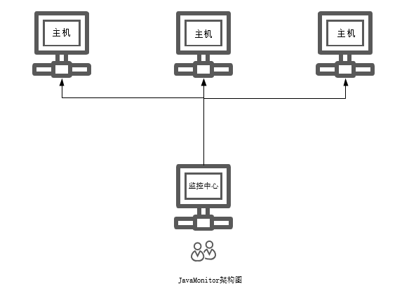

# Java应用性能远程监控系统

适用于监控所有Java应用，具有堆内存监控、方法区监控、GC监控、类加载监控、类编译监控与线程监控，提供堆快照下载，线程快照下载。体验网址：[http://116.85.23.6:8888/](http://116.85.23.6:8888/)

## 若借鉴本项目请严格遵守Apache开源协议，如下项目为本项目衍生却未作明确说明：

- https://github.com/a870439570/boot-actuator

## 一、简介

JavaMonitor 发布之后，受到了很多网友的好评，QQ群也有很多人加入反馈建议。但 JavaMonitor 的局限性也有很多，比如，无法进行远程监控，无法监控多个服务器，占用内存太大等等。为了解决上述问题，基于 JavaMonitor-0.0.7 开发而成的 JavaMonitoPlus 诞生了！JavaMonitoPlus 不仅解决了上述三个问题，而且增加了安全认证，优化了缓存，使页面访问更加流畅！

## 二、环境

要求JDK8及以上，必须有Java环境变量，且Java环境变量不冲突！

## 三、使用

首先，在releases下载发行版压缩包，解压。

在需要监控的主机上运行 client.jar 包即可，默认8081端口，可以追加参数`--server.port=9999`更改。

然后，在作为监控中心的主机上运行 server.jar 包，默认8888端口，到这里是不会成功的，因为运行之前还需要在该jar包目录下，新建application.properties配置文件并配置监控的主机列表，详细介绍接下来会说到。

## 四、主机

配置监控的主机非常简单，只需要在jar包所在目录下新建application.properties文件，配置以下字段即可。

```properties
monitor.serve[0].name=serve-1
monitor.serve[0].address=http://127.0.0.1:8081
monitor.serve[1].name=serve-1
monitor.serve[1].address=http://127.0.0.1:8082
```

注意：一定要写明HTTP协议！name值若不写，默认就是主机地址。

## 五、监控

默认监控频率为60秒，并且只记录当天产生的监控数据。

如果需要自定义监控频率与监控时长，只需要在jar包所在目录下新建application.properties文件，修改下列字段即可

```
monitor.rate=60 #监控频率/秒
monitor.cron=0 0 0 * * ? #每日的0:00:00时刻清空数据
```

连续监控1个月，示例

```
monitor.cron=0 0 0 1 * ?
```

连续监控1年，示例

```
monitor.cron=0 0 0 1 1 ? *
```

## 六、安全

默认是不开启安全认证的，若要开启请在application.properties文件中添加

```properties
monitor.open=true
```

默认用户名/密码为admin，修改方法为

```properties
monitor.username=admin
monitor.password=admin
```

## 七、MySQL

内嵌H2数据库，有诸多限制，不过JMP提供MySQL数据库的支持。

使用方法很简单，新建application.properties文本文件放在jar包目录下，修改下列参数即可，这样数据库就更换为了MySQL。

```properties
spring.datasource.driver-class-name=com.mysql.jdbc.Driver
spring.datasource.url=jdbc:mysql://127.0.0.1:3306/test?useUnicode=true&characterEncoding=utf-8&useSSL=false
spring.datasource.username=root
spring.datasource.password=123456
spring.jpa.hibernate.ddl-auto=update
```

## 八、监控参数

- S0C：s0（from）的大小
- S1C：s1（from）的大小
- S0U：s0（from）已使用的空间
- S1U：s1(from)已经使用的空间
- EC：eden区的大小
- EU：eden区已经使用的空间
- OC：老年代大小
- OU：老年代已经使用的空间
- MC：元空间的大小（Metaspace）
- MU：元空间已使用大小
- CCSC：压缩类空间大小（compressed class space）
- CCSU：压缩类空间已使用大小
- YGC：新生代gc次数
- YGCT：新生代gc耗时
- FGC：Full gc次数
- FGCT：Full gc耗时
- GCT：gc总耗时
- Loaded：表示载入了类的数量
- Unloaded：表示卸载类的数量
- Compiled：表示编译任务执行的次数
- Failed：表示编译失败的次数
- Total：线程总数
- Runnable：正在运行的线程数
- Sleeping：休眠的线程数
- Waiting：等待的线程数

## 九、关于作者

*博客：http://www.yueshutong.cn/*

*Github：https://github.com/yueshutong/JavaMonitor*

*Gitee：https://gitee.com/zyzpp/JavaMonitor*

*邮箱：yster@foxmail.com*

*QQ群：781927207*

[滴滴云免费提供云计算服务](https://www.didiyun.com/?channel=14214)


**JavaMonitorPlus监控架构图**



